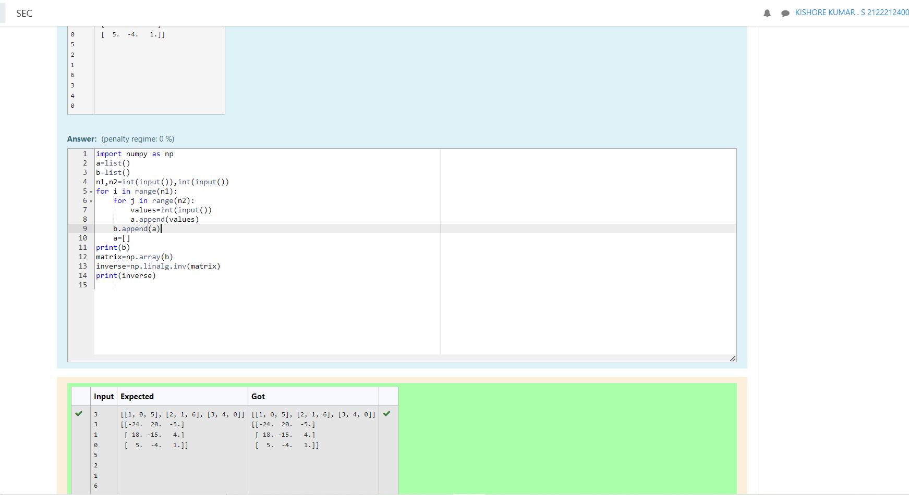

# Inverse-of-matrix

## AIM:
To write a python program to find the inverse of a matrix.

## ALGORITHM:
### Step 1:
Import Numpy module as np.
### Step 2:
Create empty lists.
### Step 3:
Get input from the user for number of rows and columns.
### Step 4:
Use nested lists to append list
### Step 5:
Print the inverse of the array using np.linalg.inv

## PROGRAM:
```
import numpy as np
a=list() 
b=list() 
n1,n2=int(input()),int(input())
for i in range(n1):
    for j in range(n2):
        values=int(input()) 
        a.append(values)
    b.append(a)
    a=[]
print(b)
matrix=np.array(b)
inverse=np.linalg.inv(matrix)
print(inverse)
```

## OUTPUT:



## RESULT:
Thus a program is written to find the inverse of the matrix.